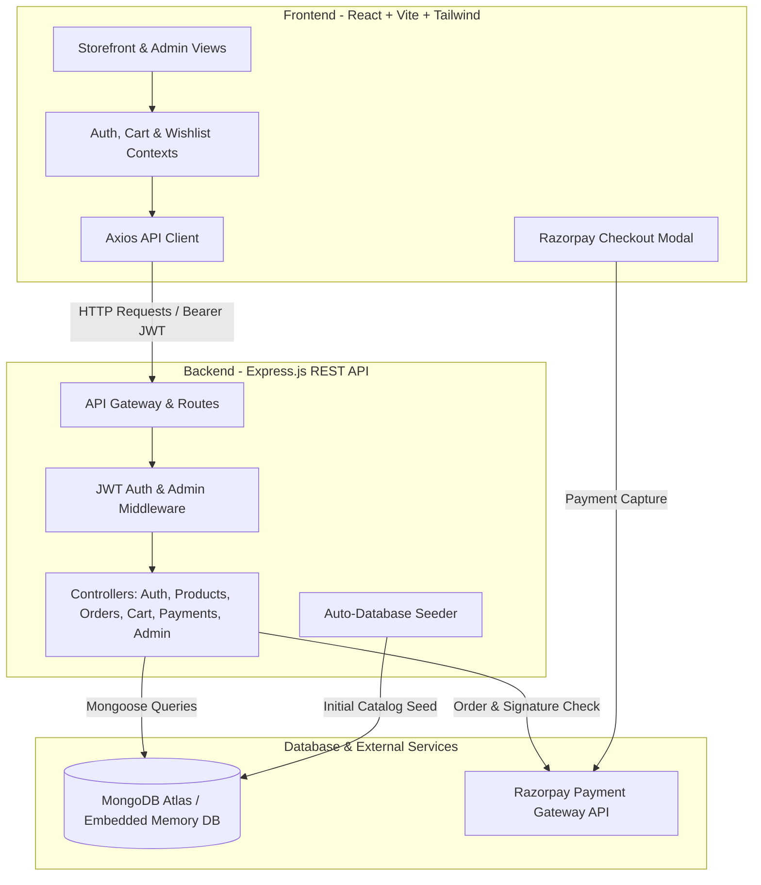

# ✨ Harsha's Creation — Luxury Own-Brand Apparel & E-Commerce Portal

<div align="center">

[](https://harsha-s-creation.vercel.app)
[](https://github.com/harshabin/harsha-s-creation-)
[](https://nodejs.org)
[](https://reactjs.org)
[](https://vitejs.dev)
[](https://www.mongodb.com/)
[](https://tailwindcss.com)
[](https://razorpay.com)
[](LICENSE)

<p align="center">
  <b>An exclusive, full-stack direct-to-consumer (D2C) fashion platform and executive merchant management suite designed for bespoke, heavyweight, and modern tailoring.</b>
</p>

[🌐 View Live Storefront](#-live-deployments--links) • [✨ Key Features](#-key-features) • [🛠️ Tech Stack](#-technology-stack) • [🚀 Quick Start](#-quick-start-guide) • [📡 API Reference](#-rest-api-documentation) • [🔐 Demo Credentials](#-demo-accounts--credentials)

---

</div>

## 🌐 Live Deployments & Links

| Service | Platform | URL | Status |
| :--- | :--- | :--- | :--- |
| **Frontend Storefront & Admin** | **Vercel** | [**https://harsha-s-creation.vercel.app**](https://harsha-s-creation.vercel.app) | 🟢 Active |
| **Source Code Repository** | **GitHub** | [**https://github.com/harshabin/harsha-s-creation-**](https://github.com/harshabin/harsha-s-creation-) | 🟢 Public |
| **Backend REST API (Sample)** | **Render / Cloud** | `https://your-backend-api.onrender.com/api` | 🟢 Active |

> 💡 *Note: If your Vercel deployment is hosted on an alternate subdomain (e.g. `https://harsha-s-creation-.vercel.app` or a custom domain), simply replace the link above and update `VITE_API_URL` accordingly.*

---

## 📖 Project Overview

**Harsha's Creation** (Established 2024) is a bespoke apparel brand and modern full-stack e-commerce web platform. Crafted from the ground up to deliver a luxury shopping experience, the platform bridges high-end consumer storefront interactions with a real-time administrative command center for catalog curation, sales analytics, and fulfillment management.

The platform includes a built-in **zero-configuration in-memory database fallback** (`mongodb-memory-server`), automated database seeder with pre-populated luxury products and test orders, seamless **Razorpay payment processing**, and fully responsive mobile-first interfaces.

---

## 🌟 Key Features

### 🛍️ 1. Customer Storefront & Shopping Experience
- **Luxury Editorial Home Page**: Dynamic hero spotlight, curated category capsules (French Terry Hoodies, Outerwear, Boxy Tees, Tailored Pants), featured collections, and new arrival showcases.
- **Advanced Catalog & Real-time Filtering**:
  - Instant multi-parameter filtering by Category, Gender (`Men`, `Women`, `Unisex`), Size (`XS` to `XXL`), Color swatches, and Price sliders.
  - Sorting by Featured, Price (Low-to-High / High-to-Low), Newest Releases, and Customer Ratings.
  - Fast live search bar across product titles, descriptions, and materials.
- **Rich Product Detail Pages**:
  - Multi-image zoom gallery with high-resolution editorial photography.
  - Interactive size selection and real-time color swatch preview.
  - Fabric composition breakdown, wash care instructions, and tailored fit specifications.
  - Stock availability badges with low-stock warnings.
  - Verified customer reviews with 5-star rating breakdowns.
- **Dynamic Cart & Slide-Over Drawer**:
  - Slide-over mini-cart accessible from any page.
  - Automatic synchronization between local storage and user database cart.
  - Real-time quantity adjustments, size/color variant tags, and subtotal calculations.
  - Free shipping indicator with progress threshold meter.
  - Promo code discounts engine.
- **Interactive Wishlist**: Save favorite designs to personal wishlist for quick purchase.

### 💳 2. Checkout & Payment Gateway
- **Multi-Step Seamless Checkout**:
  - Saved Address Book with default address selector and inline new address creator.
  - Transparent itemized order summary (Subtotal, 5% GST, Shipping calculations, Promo discounts).
- **Payment Methods**:
  - **Razorpay Online Gateway**: Integrated checkout modal for UPI (Google Pay, PhonePe, Paytm), Credit/Debit Cards, NetBanking, and Wallets.
  - **Cash on Delivery (COD)**: Instant order placement for pay-on-arrival preferences.
- **Instant Order Confirmation**: Dynamic celebratory confetti animation (`canvas-confetti`) with downloadable order summary and receipt details.

### 📦 3. Customer Order Tracking & Account Portal
- **"My Orders" Dashboard**: View full purchase history, order timestamps, and monetary breakdown.
- **Visual Order Progression**: Step-by-step milestone tracker (`Processing` ➔ `Confirmed` ➔ `Shipped` ➔ `Delivered`).
- **Logistics Metadata**: Real-time tracking numbers and assigned courier carrier information (e.g., *Aura Logistics Express*).

### 👑 4. Executive Merchant & Admin Suite (`/admin`)
- **Operations & Sales Dashboard**:
  - High-level KPIs: Total Revenue, Gross Order Count, Active Registered Customers, and Live Catalog Items.
  - Operational health metrics and recent transaction feed.
  - Interactive Admin Profile Photo modal with live avatar card on the executive banner.
- **Catalog & Inventory Management**:
  - Add, edit, and delete apparel items with instant live reflection.
  - Tag-based multi-size and multi-color input selectors.
  - Stock level management, discount price calculations, and featured/new arrival toggles.
- **Order Fulfillment Center**:
  - View all global customer orders with detailed customer contact info and delivery addresses.
  - Update order fulfillment statuses (`Processing`, `Shipped`, `Delivered`, `Cancelled`).
  - Assign tracking numbers and carrier details.
- **Customer Directory**: Inspect registered customer lists, total order frequencies, lifetime spend, and verified contact coordinates.

---

## 🛠️ Technology Stack

### Frontend Architecture
| Category | Technology | Description |
| :--- | :--- | :--- |
| **Core Framework** | React 18 (`react`, `react-dom`) | Component-driven declarative UI |
| **Build Tool & Bundler** | Vite 5.2 | Ultra-fast HMR and optimized production bundling |
| **Routing** | React Router DOM v6 | Client-side routing with protected route guards |
| **Styling & Design** | Tailwind CSS 3.4 + PostCSS | Utility-first responsive design & luxury color palettes |
| **Typography** | Google Fonts (`Outfit`, `Inter`) | Modern geometric and readable luxury typography |
| **Icons & Visuals** | Lucide React | Clean, modern featherweight vector iconography |
| **State Management** | React Context API | `AuthContext`, `CartContext`, `WishlistContext` |
| **HTTP Client** | Axios 1.6 | Promise-based asynchronous API requests with interceptors |
| **UX Enhancements** | `canvas-confetti`, `clsx`, `tailwind-merge` | Confetti bursts and dynamic class merge utilities |

### Backend Architecture
| Category | Technology | Description |
| :--- | :--- | :--- |
| **Runtime** | Node.js (v18+ / v20+) | High-performance asynchronous JavaScript runtime |
| **Server Framework** | Express.js 4.19 | Modular RESTful API server and route handlers |
| **Database & ODM** | MongoDB + Mongoose 8.3 | Document-based schema modeling and validation |
| **Embedded DB Fallback** | `mongodb-memory-server` 9.2 | In-memory MongoDB for zero-config offline/dev execution |
| **Authentication** | JSON Web Tokens (`jsonwebtoken`) + `bcryptjs` | Stateless JWT tokens and salt-hashed password security |
| **Payment Integration** | Razorpay Node SDK (`razorpay`) | Order creation, payment verification, and HMAC signatures |
| **Middleware & Logging** | `cors`, `morgan`, `dotenv` | Cross-origin access, HTTP request logging, and env config |

---

## 📐 System Architecture & Data Flow



---

## 🗄️ Database Models & Schema Design

```
├── User
│   ├── name (String)
│   ├── email (String, Unique)
│   ├── password (Hashed String)
│   ├── role ("customer" | "admin")
│   ├── avatar (String URL)
│   ├── phone (String)
│   └── addresses: [ { fullName, street, city, state, postalCode, country, phone, isDefault } ]
│
├── Product
│   ├── name (String)
│   ├── description (String)
│   ├── category ("Hoodies" | "Jackets" | "T-Shirts" | "Pants" | "Dresses" | "Shirts" | "Accessories")
│   ├── gender ("Men" | "Women" | "Unisex")
│   ├── sizes: ["XS", "S", "M", "L", "XL", "XXL", "Free Size"]
│   ├── colors: [ { name, hex } ]
│   ├── price (Number)
│   ├── discountPrice (Number)
│   ├── stock (Number)
│   ├── images: [ String URL ]
│   ├── fabricDetails: { composition, care, fit }
│   ├── isFeatured (Boolean)
│   ├── isNewArrival (Boolean)
│   ├── rating (Number)
│   └── numReviews (Number)
│
├── Cart
│   ├── user (Ref: User)
│   ├── items: [ { product, name, image, size, color, quantity, price } ]
│   └── totalAmount (Number)
│
├── Order
│   ├── user (Ref: User)
│   ├── items: [ { product, name, image, size, color, quantity, price } ]
│   ├── shippingAddress: { fullName, street, city, state, postalCode, country, phone }
│   ├── paymentMethod ("Razorpay" | "Cash on Delivery")
│   ├── paymentStatus ("Pending" | "Paid" | "Failed")
│   ├── paymentResult: { id, status, razorpay_order_id, razorpay_payment_id }
│   ├── itemsPrice, taxPrice, shippingPrice, discountAmount, totalAmount
│   ├── status ("Pending" | "Processing" | "Confirmed" | "Shipped" | "Delivered" | "Cancelled")
│   ├── trackingNumber (String)
│   ├── carrier (String)
│   └── paidAt, deliveredAt (Dates)
│
└── Review
    ├── user (Ref: User)
    ├── product (Ref: Product)
    ├── rating (Number 1-5)
    ├── title (String)
    ├── comment (String)
    └── isVerified (Boolean)
```

---

## 📡 REST API Documentation

Base Endpoint: `/api`

### 🔑 Authentication & Profile (`/api/auth`)
| Method | Endpoint | Access | Description |
| :--- | :--- | :--- | :--- |
| `POST` | `/api/auth/register` | Public | Register new user account with auto JWT generation |
| `POST` | `/api/auth/login` | Public | Authenticate user credentials & receive token |
| `GET` | `/api/auth/me` | Private | Retrieve current user profile & address book |
| `PUT` | `/api/auth/me` | Private | Update user details (name, email, password, avatar) |
| `POST` | `/api/auth/addresses` | Private | Add or update a shipping address |

### 👕 Products & Catalog (`/api/products`)
| Method | Endpoint | Access | Description |
| :--- | :--- | :--- | :--- |
| `GET` | `/api/products` | Public | Fetch products with filter (`category`, `gender`, `isFeatured`, `search`, `sort`) |
| `GET` | `/api/products/:id` | Public | Fetch detailed product data by MongoDB ID |
| `POST` | `/api/products/:id/reviews`| Private | Submit verified customer product review & rating |

### 🛒 Shopping Cart (`/api/cart`)
| Method | Endpoint | Access | Description |
| :--- | :--- | :--- | :--- |
| `GET` | `/api/cart` | Private | Get active user's persistent shopping cart |
| `POST` | `/api/cart` | Private | Add item (with specific size and color) to cart |
| `PUT` | `/api/cart/:itemId` | Private | Update item quantity in cart |
| `DELETE`| `/api/cart/:itemId` | Private | Remove specific line item from cart |
| `DELETE`| `/api/cart` | Private | Clear all items from user cart |

### 📦 Customer Orders (`/api/orders`)
| Method | Endpoint | Access | Description |
| :--- | :--- | :--- | :--- |
| `POST` | `/api/orders` | Private | Create new order (Razorpay or COD) |
| `GET` | `/api/orders/my-orders`| Private | Retrieve all historical orders for authenticated user |
| `GET` | `/api/orders/:id` | Private | Get single order details with tracking info |

### 💳 Payments (`/api/payment`)
| Method | Endpoint | Access | Description |
| :--- | :--- | :--- | :--- |
| `POST` | `/api/payment/initiate` | Private | Create Razorpay order ID for checkout session |
| `POST` | `/api/payment/verify` | Private | Verify Razorpay payment signature (HMAC-SHA256) |
| `POST` | `/api/payment/webhook` | Public | Webhook endpoint for asynchronous payment updates |

### 👑 Admin Management (`/api/admin`)
| Method | Endpoint | Access | Description |
| :--- | :--- | :--- | :--- |
| `GET` | `/api/admin/stats` | Admin | Get executive metrics (revenue, order counts, stats) |
| `POST` | `/api/admin/products` | Admin | Create a new clothing product in catalog |
| `PUT` | `/api/admin/products/:id`| Admin | Update existing product specs, prices, stock |
| `DELETE`| `/api/admin/products/:id`| Admin | Delete product from catalog |
| `GET` | `/api/admin/orders` | Admin | Retrieve all customer orders across store |
| `PUT` | `/api/admin/orders/:id` | Admin | Update status (`Shipped`, `Delivered`) & tracking info |
| `GET` | `/api/admin/customers` | Admin | Retrieve complete customer list with spend data |

---

## 🔐 Demo Accounts & Credentials

The application includes pre-seeded demo accounts with one-click auto-fill buttons on the login page:

| Role | Email | Password | Access Level |
| :--- | :--- | :--- | :--- |
| **Store Administrator** | `admin@ownbrand.com` | `Admin@123` | Full Merchant Dashboard & Storefront Access |
| **Registered Customer** | `customer@ownbrand.com` | `Customer@123` | Standard Storefront, Cart, Checkout & Orders |

---

## 💻 Environment Variables Configuration

### 1. Backend (`backend/.env`)
Create a `.env` file inside the `backend` directory:

```env
# Server Configuration
PORT=5000
NODE_ENV=development

# Database Connection (Leave empty or omit to use automatic In-Memory MongoDB)
MONGO_URI=mongodb://localhost:27017/ownbrand_cloth_db
# Or MongoDB Atlas:
# MONGO_URI=mongodb+srv://<username>:<password>@cluster.mongodb.net/cloth_db?retryWrites=true&w=majority

# Authentication Secret
JWT_SECRET=super_secret_jwt_key_harshas_creation_2024
JWT_EXPIRE=7d

# Razorpay Payment Gateway Keys (Test or Live)
RAZORPAY_KEY_ID=rzp_test_yourKeyHere
RAZORPAY_KEY_SECRET=yourRazorpayKeySecretHere

# Client Application URL
CLIENT_URL=http://localhost:5173
```

### 2. Frontend (`frontend/.env`)
Create a `.env` file inside the `frontend` directory (optional for local dev):

```env
# URL pointing to the running backend API
VITE_API_URL=http://localhost:5000/api

# For Vercel production deployments:
# VITE_API_URL=https://your-backend-api.onrender.com/api
```

---

## 🚀 Quick Start Guide

### Prerequisites
- **Node.js** (v18.0.0 or higher recommended)
- **npm** (v9.0.0 or higher) or **yarn** / **pnpm**
- **Git**

### 1. Clone the Repository
```bash
git clone https://github.com/harshabin/harsha-s-creation-.git
cd harsha-s-creation-
```

### 2. Install All Dependencies
Install dependencies for root, backend, and frontend with a single command:
```bash
npm install
npm run dev --prefix backend -- --dry-run 2>/dev/null || true
cd backend && npm install && cd ../frontend && npm install && cd ..
```

### 3. Run Development Server (Both Frontend & Backend)
From the root workspace directory, run:
```bash
npm run dev
```
This executes `concurrently` to spin up:
- 🚀 **Backend Express API** on `http://localhost:5000` (auto-seeds database on first launch)
- ⚡ **Frontend Vite Client** on `http://localhost:5173`

Open your browser and navigate to:
```
http://localhost:5173
```

---

## 🚢 Deployment Guide

### Deploying Frontend to Vercel
1. **Push your code to GitHub** repository.
2. Sign in to [Vercel](https://vercel.com) and click **"Add New Project"** ➔ **Import Git Repository**.
3. Configure the Project Settings:
   - **Root Directory**: `frontend`
   - **Framework Preset**: `Vite`
   - **Build Command**: `npm run build`
   - **Output Directory**: `dist`
4. Add Environment Variable in Vercel Dashboard:
   - `VITE_API_URL`: `https://your-backend-api.onrender.com/api` (URL of your deployed backend)
5. Click **Deploy**. Vercel will automatically build and assign your live URL (e.g. `https://harsha-s-creation.vercel.app`).
6. The included [`frontend/vercel.json`](file:///e:/ai%20built%20project%20fullstack/frontend/vercel.json) handles single-page application (SPA) routing rewrites seamlessly:
   ```json
   {
     "rewrites": [
       { "source": "/(.*)", "destination": "/index.html" }
     ]
   }
   ```

### Deploying Backend to Render / Railway
1. Create a new **Web Service** on [Render](https://render.com) or [Railway](https://railway.app).
2. Connect your GitHub repository.
3. Configure settings:
   - **Root Directory**: `backend`
   - **Environment**: `Node`
   - **Build Command**: `npm install`
   - **Start Command**: `npm start`
4. Configure Environment Variables in the service dashboard (`MONGO_URI`, `JWT_SECRET`, `RAZORPAY_KEY_ID`, `RAZORPAY_KEY_SECRET`, `NODE_ENV=production`).

---

## 📁 Repository Directory Structure

```
e:/ai built project fullstack/
├── backend/
│   ├── config/
│   │   └── db.js                 # MongoDB connection & MemoryServer fallback
│   ├── controllers/
│   │   ├── adminController.js     # Dashboard stats & customer management
│   │   ├── authController.js      # User registration, login, profile & addresses
│   │   ├── cartController.js      # Persistent cart CRUD operations
│   │   ├── orderController.js     # Order placement & fulfillment tracking
│   │   ├── paymentController.js   # Razorpay initiate, verify & webhooks
│   │   └── productController.js   # Product catalog & customer review controller
│   ├── middleware/
│   │   ├── authMiddleware.js      # JWT verification & admin guard
│   │   └── errorMiddleware.js     # 404 handler and central error response
│   ├── models/
│   │   ├── Cart.js                # Shopping cart Mongoose schema
│   │   ├── Order.js               # Order & fulfillment Mongoose schema
│   │   ├── Product.js             # Apparel product specs Mongoose schema
│   │   ├── Review.js              # Product review Mongoose schema
│   │   └── User.js                # Customer & admin account Mongoose schema
│   ├── routes/
│   │   ├── adminRoutes.js         # /api/admin routes
│   │   ├── authRoutes.js          # /api/auth routes
│   │   ├── cartRoutes.js          # /api/cart routes
│   │   ├── orderRoutes.js         # /api/orders routes
│   │   ├── paymentRoutes.js       # /api/payment routes
│   │   └── productRoutes.js       # /api/products routes
│   ├── utils/
│   │   └── seeder.js              # Comprehensive catalog & test account seeder
│   ├── .env.example               # Template environment variables
│   ├── package.json               # Backend dependencies & scripts
│   └── server.js                  # Express app initialization & server entry point
│
├── frontend/
│   ├── public/                    # Static assets & web manifest
│   ├── src/
│   │   ├── components/
│   │   │   ├── admin/             # AdminLayout, ProfilePhotoModal
│   │   │   ├── auth/              # ProtectedRoute, AdminRoute
│   │   │   ├── cart/              # CartDrawer slide-over
│   │   │   ├── common/            # Navbar, Footer, LoadingSpinners
│   │   │   └── product/           # ProductCard, FilterSidebar, ReviewList
│   │   ├── context/
│   │   │   ├── AuthContext.jsx    # User auth state & avatar management
│   │   │   ├── CartContext.jsx    # Persistent cart, discount & total state
│   │   │   └── WishlistContext.jsx# Favorite item persistence
│   │   ├── pages/
│   │   │   ├── admin/
│   │   │   │   ├── AdminCustomersPage.jsx   # Customer directory table
│   │   │   │   ├── AdminDashboardPage.jsx   # Metrics, charts & profile banner
│   │   │   │   ├── AdminOrdersPage.jsx      # Order fulfillment & status updates
│   │   │   │   └── AdminProductsPage.jsx    # Product inventory manager & modal
│   │   │   ├── CartPage.jsx                 # Full cart page with checkout prompt
│   │   │   ├── CheckoutPage.jsx             # Address book & dual payment gateway
│   │   │   ├── HomePage.jsx                 # Editorial luxury landing page
│   │   │   ├── LoginPage.jsx                # Split auth screen with demo fill
│   │   │   ├── MyOrdersPage.jsx             # Customer purchase list
│   │   │   ├── OrderDetailPage.jsx          # Live tracking timeline & receipt
│   │   │   ├── OrderSuccessPage.jsx         # Confetti celebratory confirmation
│   │   │   ├── ProductDetailPage.jsx        # Gallery, specs & review form
│   │   │   ├── RegisterPage.jsx             # New customer registration
│   │   │   ├── ShopPage.jsx                 # Full catalog with dynamic filters
│   │   │   └── WishlistPage.jsx             # Saved designs collection
│   │   ├── services/                        # Axios API integration modules
│   │   ├── utils/                           # Formatters (INR currency, dates)
│   │   ├── App.jsx                          # Route definitions & layout shell
│   │   ├── index.css                        # Tailwind directives & luxury styles
│   │   └── main.jsx                         # React root mount
│   ├── index.html                           # HTML template with Google Fonts & Razorpay
│   ├── package.json                         # Frontend dependencies & scripts
│   ├── tailwind.config.js                   # Custom brand colors & typography tokens
│   ├── vercel.json                          # Vercel SPA rewrite configuration
│   └── vite.config.js                       # Vite bundler plugins & proxy setup
│
├── package.json                             # Workspace root package for concurrent execution
├── .gitignore                               # Node modules & env ignore rules
└── README.md                                # Comprehensive documentation
```

---

## 🤝 Contributing

Contributions, issues, and feature requests are welcome!

1. Fork the project repository (`https://github.com/harshabin/harsha-s-creation-`).
2. Create your Feature Branch (`git checkout -b feature/AmazingFeature`).
3. Commit your Changes (`git commit -m 'Add some AmazingFeature'`).
4. Push to the Branch (`git push origin feature/AmazingFeature`).
5. Open a Pull Request.

---

## 📄 License

Distributed under the **MIT License**. See `LICENSE` for more information.

---

<div align="center">
  <sub>Built with ❤️ for <b>Harsha's Creation</b>. Engineered with modern React, Express, MongoDB, and Tailwind CSS.</sub>
</div>
